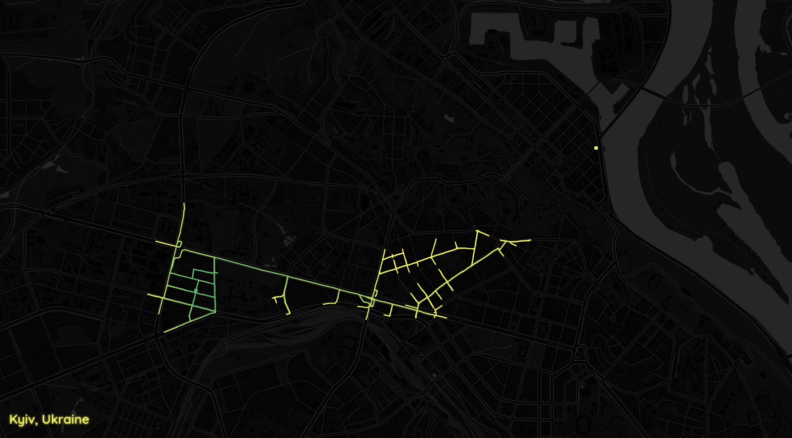
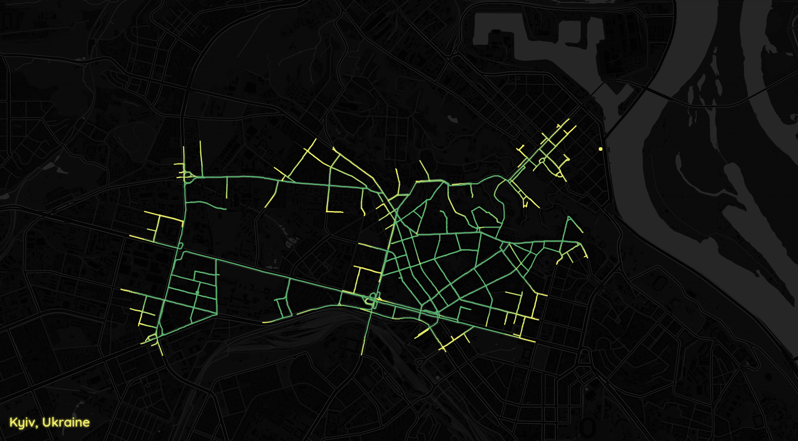
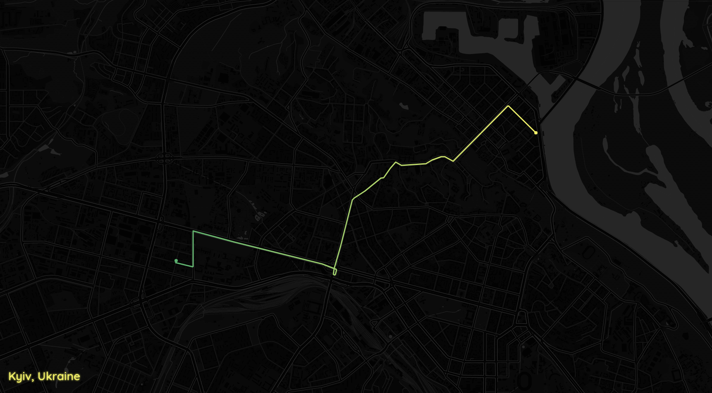

# A* Pathfinding Visualization on a Real Map

This project visualizes the **A\*** search algorithm on a real-world road network using data from [OpenStreetMap](https://www.openstreetmap.org/). It consists of two major components:

- **Path Resolver** (`path-resolver/src/main.ipynb`): Downloads the graph, runs the A* algorithm, and exports data.
- **Animation Viewer** (`animation/index.html`): An animated visualization of the computed path using Leaflet.js and Tailwind CSS.

## 🧠 Key Features

- A* pathfinding between real geographic coordinates
- Interactive visualization with:
  - Animated step-by-step exploration
  - Final glowing path highlight
  - Custom color transitions
- Works entirely in-browser (HTML + JS, no backend needed)
- Built with:
  - Python: [OSMnx](https://github.com/gboeing/osmnx), NetworkX
  - Frontend: Leaflet.js, Tailwind CSS, Google Fonts

---

## 📁 Project Structure

```
.
├── animation/
│   └── index.html              # Leaflet visualization with animation
├── data/
│   ├── astar_path.json         # Final path node sequence
│   ├── astar_steps.json        # Steps during A* exploration
│   └── graph_nodes_edges.json  # Nodes & edges with coordinates
├── path-resolver/
│   ├── cache/                  # OSMnx local cache
│   └── src/
│       └── main.ipynb          # Jupyter Notebook for graph + A* logic
├── .gitignore
└── README.md                   # This file
```

---

## 🚀 How to Run

### 1. Install Python dependencies

Use a virtual environment and install the required packages:

```bash
python3 -m venv .venv
source .venv/bin/activate
pip install osmnx networkx
```

### 2. Generate Path Data

Run the notebook:

```bash
cd path-resolver/src
jupyter notebook main.ipynb
```

It will:
- Download the street graph around Kyiv
- Find the shortest path using A*
- Save `astar_path.json`, `astar_steps.json`, and `graph_nodes_edges.json` into the `data/` folder

### 3. Visualize the Path

Open the animation:

```bash
cd animation
open index.html   # or just drag it into your browser
```

You’ll see:
- The pathfinding steps animated live
- Start and end markers
- A glowing final path

---

## 🗺️ Example

> Kyiv, Ukraine - 10km radius search area  
> Nodes: ~7,000+  
> Output: JSON files used for animated rendering







---

## 📦 Output Files Explained

| File                        | Description                             |
|-----------------------------|-----------------------------------------|
| `astar_steps.json`          | Step-by-step log of A* exploration      |
| `astar_path.json`           | List of node IDs from start to goal     |
| `graph_nodes_edges.json`    | Node coordinates and edge lengths       |

These are loaded in `index.html` via JavaScript and rendered with Leaflet.

---

## ✨ Credits

- 🧠 A* algorithm logic: custom implementation using NetworkX
- 🗺️ Map data: [OpenStreetMap](https://www.openstreetmap.org)
- 🧩 Graph downloading: [OSMnx](https://github.com/gboeing/osmnx)
- 🌐 Interactive visualization: [Leaflet.js](https://leafletjs.com/)

---

## 📌 Future Improvements

- Add interactivity (click to select points on the map)
- Add playback controls (pause/resume/step)
- Export to video or GIF
- Add alternative algorithms (Dijkstra, BFS, etc.)

---

## 📝 License

MIT License — free to use, modify and distribute.
